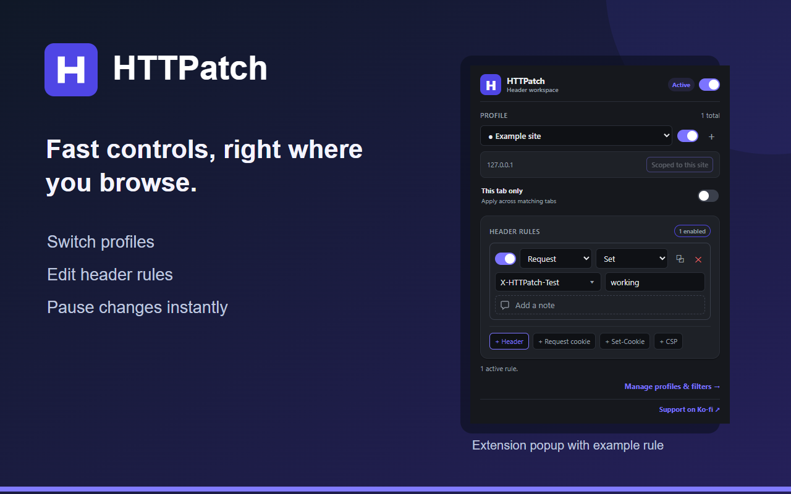

# HTTPatch

Create profiles that modify HTTP request and response headers. HTTPatch is free,
ad-free and built with TypeScript, Preact and Manifest V3 for Chromium browsers
and Firefox.

[Support development on Ko-fi](https://ko-fi.com/lukeosland) if you find it useful.
Donations do not unlock features.



[Options page](docs/screenshots/options-light.png) · [Dark view](docs/screenshots/options-dark.png) ·
[Header picker](docs/screenshots/popup-header-picker.png)

## Features

- **Edit headers:** set, append or remove request and response headers. Search popular
  header names as you type, or enter your own. Duplicate rules and add notes.
- **Organise profiles:** name, colour, enable and disable profiles; set toolbar badges
  and pause every rule with one switch. All enabled profiles can apply at once.
- **Scope precisely:** filter by request URL and resource type, scope a profile to
  the current site in one click, or apply it only in a selected browser tab.
- **Use focused editors:** add request cookies, response Set-Cookie headers and
  Content-Security-Policy directives without writing the whole value by hand.
- **Keep your setup:** preview and import JSON profiles, export backups, and sync
  between devices through your browser account with first-sync merge controls.
- **Choose your theme:** light by default, with dark and system appearances. No ads, analytics,
  developer account or paid features.

Browser limits still apply: request-header append supports a fixed allowlist,
header values are static, and up to 5,000 active dynamic rules are supported.
See the [feature comparison](docs/FEATURE_PARITY.md) for current limits and planned work.

## Get started

1. Open the toolbar popup and create a profile or select one to edit.
2. Add a header rule. Choose **Request** or **Response**, an operation, a name and
   a value. The name field filters suggestions as you type.
3. Use **Scope to this site** for the current domain, or open **Manage profiles &
   filters** for URL and resource-type filters. Use **This tab only** when the rule
   should stay in one browser tab.

Site scope matches **request URLs**. Requests from the page to third-party domains
need their own filters. Selecting a profile changes which one you edit; it does not
turn off other enabled profiles. The [user guide](docs/USER_GUIDE.md) has examples.

## Install from source

There is no signed public release yet. Build the extension locally with Node.js
22.13 or newer (CI uses Node 24):

```sh
npm ci
npm run build
```

In Chrome, open `chrome://extensions`, enable **Developer mode**, choose
**Load unpacked**, and select `dist/`. Use your browser's equivalent extensions
page for other Chromium browsers.

For Firefox:

```sh
npm run build:firefox
```

Open `about:debugging#/runtime/this-firefox`, choose **Load Temporary Add-on**,
and select `dist-firefox/manifest.json`. Permanent installation requires a
Mozilla-signed package.

## Privacy

Rules and header values are stored locally in plaintext. **Browser sync is on by
default and includes header values**, which may contain credentials. Turn it off
in the options page if you do not want those values copied to your browser account;
**Remove synced copy** deletes previously synced data.

HTTPatch has no content scripts, analytics or developer-operated server. It uses
the browser's declarative rules API and does not read page content or request bodies.
The Ko-fi link opens only when clicked; payments are handled on Ko-fi.
See the [public privacy policy](https://lukeosland1.github.io/HTTPatch-privacy/)
or [PRIVACY.md](PRIVACY.md) for details.

## Development

```sh
npm run lint
npm run format:check
npm test
npm run build
npm run check:manifest
npm run build:firefox
npm run lint:firefox
npm run test:browser
```

Run `npm run build` before the packaged browser test. See [CONTRIBUTING.md](CONTRIBUTING.md)
for the full validation, packaging and release process.

- [Architecture](docs/ARCHITECTURE.md)
- [Store listing draft and release checklist](docs/RELEASE_PREP.md)
- [Changelog](CHANGELOG.md)

## Credits and licence

HTTPatch is created and maintained by [Luke Osland](https://github.com/LukeOsland1)
and distributed under the MIT licence.
See [LICENSE](LICENSE). Both browser packages include the licence and privacy policy.
